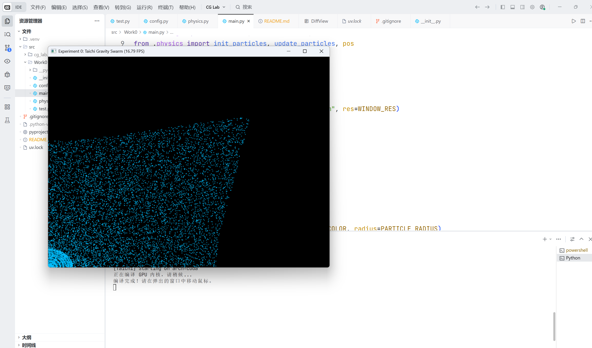
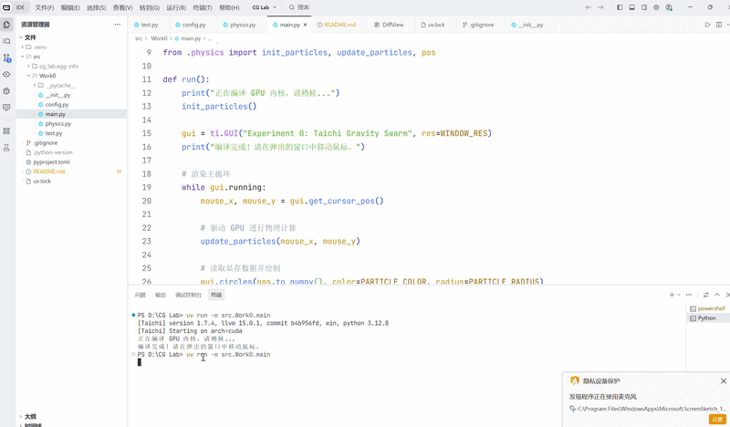

# CG-Lab：计算机图形学课程实验 - 万有引力粒子群仿真

## 项目简介

本项目是计算机图形学课程作业，基于 Taichi 语言实现了一个万有引力粒子群仿真。程序利用 GPU 并行计算模拟大量粒子在相互引力作用下的运动，并提供了实时交互的渲染窗口。项目采用 src 布局，使用 uv 工具链管理依赖和虚拟环境。

## 项目架构

项目采用标准的 `src` 布局，所有核心代码均位于 `src/Work0/` 目录下：


```
.
├── .gitignore                  # Git 忽略文件
├── pyproject.toml              # 项目依赖与元数据（使用 uv 管理）
├── README.md                   # 本文档
├── uv.lock                     # 依赖锁定文件
└── src/
    └── Work0/                  # 主包名（注意大小写）
        ├── __init__.py         # 包初始化文件
        ├── config.py           # 仿真参数配置（粒子数、引力常数、时间步长等）
        ├── physics.py          # 物理计算模块（万有引力、速度/位置更新，使用 Taichi）
        ├── main.py             # 程序入口，负责 GUI 窗口和主循环
        └── test.py             # 简单测试脚本
```


---


## 代码逻辑说明


### 1. 参数配置（`config.py`）

集中管理所有仿真参数，便于调整：
- `NUM_PARTICLES`：粒子数量
- `GRAVITY_STRENGTH`：引力强度
- `DRAG_COEF`：空气阻力系数
- `BOUNCE_COEF`：边界反弹能量损耗
- `WINDOW_RES`：窗口分辨率
- `PARTICLE_RADIUS`：粒子绘制半径
- `PARTICLE_COLOR`：粒子颜色


### 2. 物理计算（`physics.py`）

- 使用 `ti.field` 在 GPU 上声明粒子位置、速度等场。
- `@ti.kernel` 装饰的 GPU 内核函数：
  - `init_particles()`：初始化每个粒子的随机坐标
  - `update_particles()`：计算粒子受到的鼠标引力，更新速度和位置，并处理边界碰撞
- 所有计算均在 GPU 上并行执行，大幅提升性能。


### 3. 主程序（`main.py`）

- 初始化 Taichi 环境（`ti.init(arch=ti.gpu)`）。
- 创建 GUI 窗口（`ti.GUI`）。
- 主循环中：
  - 获取鼠标位置。
  - 调用 `update_particles()` 更新粒子状态。
  - 渲染粒子到窗口。
- 运行后出现实时粒子运动窗口，用户可通过移动鼠标与粒子群交互。


---


## 运行方式


### 环境要求

- Python 3.8 或更高版本
- `https://docs.astral.sh/uv/` 包管理工具（推荐）
- 操作系统：Windows / Linux / macOS（需支持 GPU 加速）


### 安装与运行步骤

1. **克隆仓库**（如果是自己本地项目则跳过）：

   ```bash
   git clone https://github.com/你的用户名/CG-Lab.git
   cd CG-Lab
   ```


2. **创建虚拟环境并安装依赖**（使用 uv）：

   ```bash
   uv pip install -e .
   ```
   该命令会根据 `pyproject.toml` 安装所需依赖（如 `taichi`），并将当前项目以可编辑模式安装，确保 `Work0` 包可以被正确导入。


3. **运行仿真**：

   ```bash
   uv run -m Work0.main
   ```
   稍等片刻，即可看到粒子仿真窗口。


> **注意**：如果遇到模块找不到的错误，请确认当前终端路径在项目根目录，并且已经执行过安装步骤。


---


## 功能展示


### 运行效果截图




### 演示视频（GIF）


*图2：粒子群交互演示* 


---


## 依赖清单

- `taichi>=1.7.4`：核心计算与渲染库

具体版本参见 `pyproject.toml`。


---


## 注意事项

- 请确保你的 GPU 支持 Taichi 所需的图形 API（Vulkan / Metal / CUDA），如有问题可参考 `https://docs.taichi-lang.org/`。
- 粒子数量较大时（例如 > 5000），请确保有足够显存，并可根据需要调整 `config.py` 中的参数。
- 若运行时出现卡顿，可减小 `NUM_PARTICLES` 的值（例如改为 2000）。


---


## 作者

- [rg31]
- 课程：计算机图形学


---


**最后更新**：2026年3月